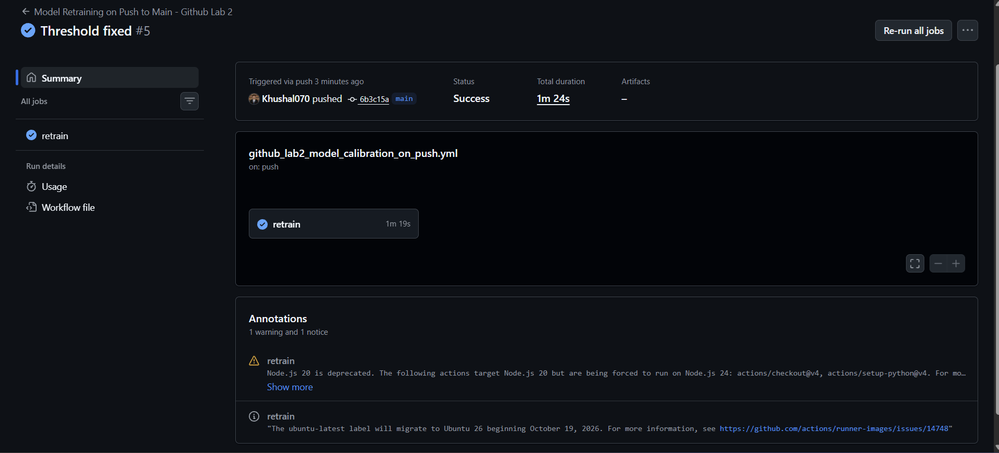
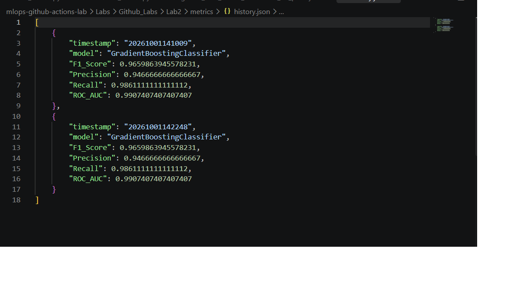
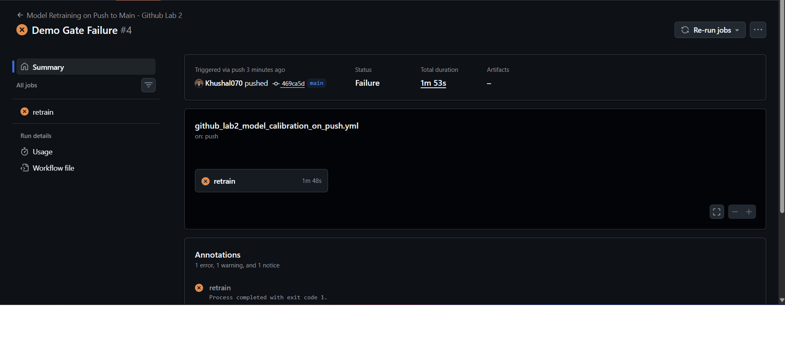
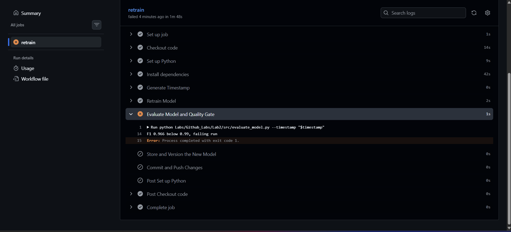

# MLOps Lab 2 - GitHub Actions Model Retraining

Fork of [raminmohammadi/MLOps](https://github.com/raminmohammadi/MLOps). Lab used: `Labs/Github_Labs/Lab2`.

A push to `main` trains a model, evaluates it, versions it with a timestamp, and commits the model and metrics back to the repo. A quality gate stops the run if the model is not good enough.

## What I changed

| Area | Original | Mine |
|---|---|---|
| Data | Random synthetic data from `make_classification` | scikit-learn breast cancer dataset with a fixed train/test split (`random_state=42`) |
| Model | RandomForest | GradientBoostingClassifier |
| Metrics | F1 only | F1, precision, recall, ROC-AUC, computed on the held-out test set |
| Quality gate | None | Evaluation exits with code 1 if F1 < 0.90, so the model and commit steps never run |
| Version tracking | One metrics file per run | Each run also appends to `metrics/history.json` (timestamp, model, scores) |
| Trigger | Push only | Push, plus manual `workflow_dispatch` |
| Workflow | Needed a personal git identity and had no explicit permissions | Uses the GitHub Actions bot and `permissions: contents: write` |

## Bugs fixed in the original

- `n_samples=random.randint(0, 2000)` can return 0 and crash training.
- Training and evaluation each generated different random data, so the F1 score did not mean much. Both now use the same split.
- The extra daily scheduled workflow referenced a variable from an earlier step and would fail at the commit step, so I removed it. I also removed the workflows for other labs so only Lab 2 runs.

## Pipeline

1. Generate a timestamp
2. `train_model.py` trains and saves `model_<timestamp>_dt_model.joblib`
3. `evaluate_model.py` computes metrics, appends to `history.json`, and applies the F1 gate
4. Model and metrics move into `Labs/Github_Labs/Lab2/models` and `metrics`
5. The bot commits and pushes them

## Results

Both successful runs gave the same scores, because the split and model seed are fixed. I kept it fixed on purpose so versions are comparable.

| F1 | Precision | Recall | ROC-AUC |
|---|---|---|---|
| 0.966 | 0.947 | 0.986 | 0.991 |

## Screenshots

Successful runs:

`history.json` after two runs:

Quality gate demo. I set the threshold to 0.99 and the run failed:

I then set the threshold back to 0.90 and the next run passed.

## Limitation

Committing model files to git works for a small model like this one but does not scale. In production I would store models in a registry or artifact store such as MLflow or W&B Artifacts, and keep only metadata in the repo.